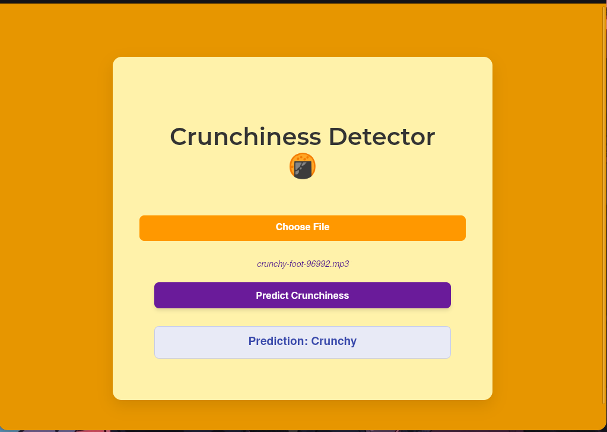
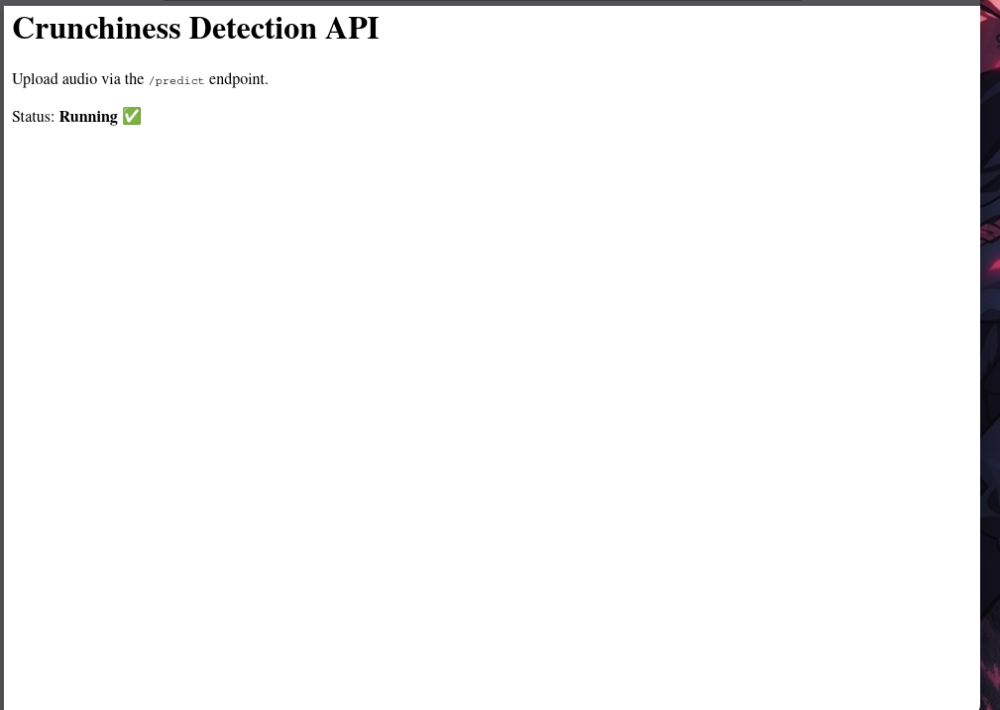

# Crispy-Parripuvada 🎯


## Basic Details
### Team Name: Kurians


### Team Members
- Member 2: Askhay M Nair - SCT College of Engineering
- Member 3: Joel - SCT College of Engineering

### Project Description
Find the crispiness of the Parippuvada you are eating..

### The Problem (that doesn't exist)
Chaaya Kadas giving old, non crispy parippuvadas

### The Solution (that nobody asked for)
By testing the crunchiness of the parippuvada

## Technical Details
### Technologies/Components Used
For Software:
- Html
- Flask
- Scikit-Learn
- Librosa

### Implementation
For Software:
# Installation
For Linux
```python -m venv myenv
```
```source myenv/bin/activate
```
```pip install -r requirements.txt
```

# Run
```python app.py
```

# Screenshots (Add at least 3)

Html Page


Backend Server


Input Area

## Team Contributions
- Akshay
- Joel

---
Made with ❤️ at TinkerHub Useless Projects 


